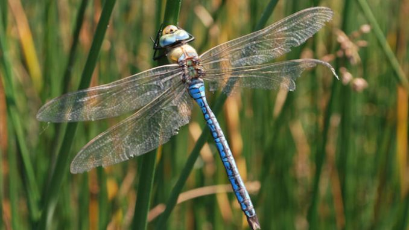

# Perfil académico
**Nombre**: Oscar Vásquez Bolaños  
**Profesión**: Biólogo  

## Áreas de interés
1. Manejo Integrado del recurso hídrico
2. Biodiversidad
3. Conservación

### Cursos impartidos
- Biología trópical
    - Laboratorio de biología tropical   
- Ciencias ambiental  
- Cambio clímatico  
[Maestría GIRH](https://www.sep.ucr.ac.cr/posgrados/geografia/folleto/maestria_academica_recurso_hidrico.pdf)
